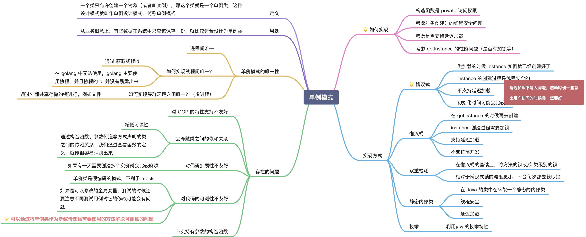
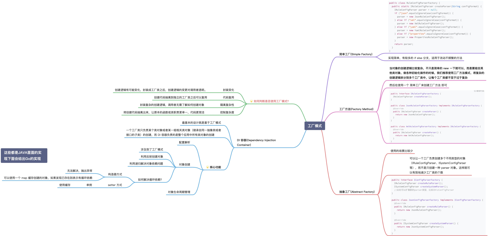
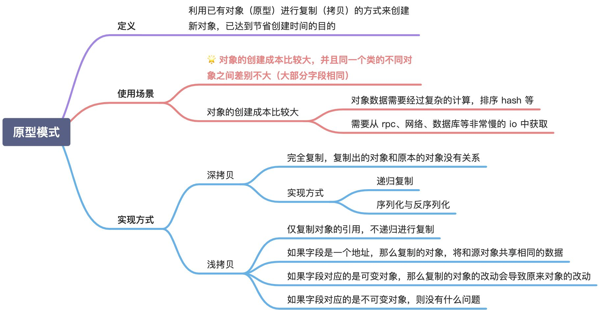

# 设计模式

## 参考文章
[设计模式](https://lailin.xyz/post/singleton.html) | 
[菜鸟教程](https://www.runoob.com/design-pattern/design-pattern-intro.html)

## 创建型
### 单例模式
[懒汉式](./singleton/lazy_test.go) | 
[饿汉式](./singleton/eager_test.go)

### 工厂模式
[简单工厂](./factory/easy_test.go) | 
[工厂方法](./factory/factory_test.go) | 
[抽象工厂](./factory/abstract_test.go)

### 建造者模式
[建造者模式](./builder/builder_test.go)

### 原型模式
[原型模式](./prototype/prototype_test.go)

## 结构型
### 代理模式

