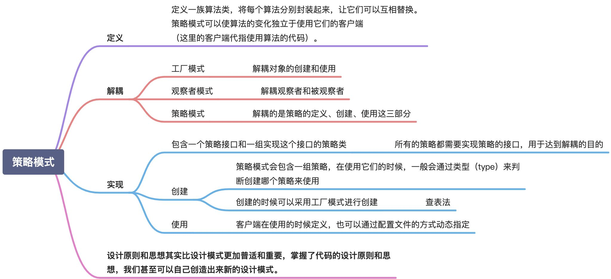

# 设计模式

## 参考文章
[设计模式](https://lailin.xyz/post/singleton.html) | 
[菜鸟教程](https://www.runoob.com/design-pattern/design-pattern-intro.html)

## 创建型
### 1.单例模式
[懒汉式](./create/singleton/lazy_test.go) | 
[饿汉式](./create/singleton/eager_test.go)

### 2.工厂模式
[简单工厂](./create/factory/easy_test.go) | 
[工厂方法](./create/factory/factory_test.go) | 
[抽象工厂](./create/factory/abstract_test.go)

### 3.建造者模式
[建造者模式](./create/builder/builder_test.go)

### 4.原型模式
[原型模式](./create/prototype/prototype_test.go)

## 结构型
### 5.代理模式
[静态代理](./struct/proxy/static_test.go) | 
[动态代理](./proxy/generate_test.go)

### 6.桥接模式
[桥接模式](./struct/bridge/bridge_test.go)

### 7.装饰器模式
[装饰器模式](./struct/decorator/decorator_test.go)

### 8.适配器模式
[适配器模式](./struct/adapter/adapter_test.go)

### 9.门面模式
[门面模式](./struct/facade/facade_test.go)

### 10.组合模式
[组合模式](./struct/composite/composite_test.go)

### 11.享元模式
[享元模式](./struct/flyweight/flyweight_test.go)

## 行为模式
### 12.观察者模式
[观察者模式](./behavior/observer/observer_test.go) | 
[EventBus](./behavior/observer/eventbus_test.go)

### 13.模板模式
[模板模式](./behavior/template/template_test.go)

### 14.策略模式
[策略模式](./behavior/strategy/strategy_test.go)

### 15.责任链模式
[责任链模式](./behavior/chain/chain_test.go)

### 16.状态模式
[状态模式](./behavior/state/state_test.go)

### 17.迭代器模式
[迭代器模式](./behavior/iterator/iterator_test.go)

### 18.访问者模式
[访问者模式](./behavior/visitor/visitor_test.go)

### 19.备忘录模式
[备忘录模式](./behavior/memento/memento_test.go)

### 20.命令模式
[命令模式](./behavior/command/command_test.go)

### 21.解释器模式
[解释器模式](./behavior/interpreter/interpreter_test.go)

### 22.中介模式
[中介模式](./behavior/mediator/mediator_test.go)

