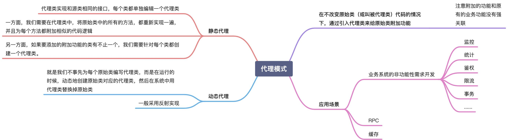
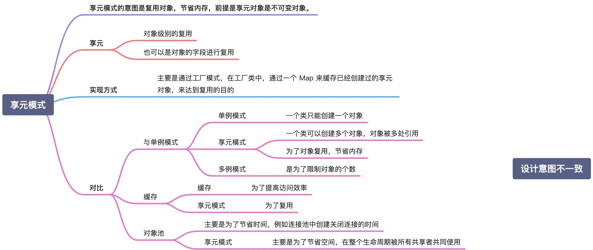

# 设计模式

## 参考文章
[设计模式](https://lailin.xyz/post/singleton.html) | 
[菜鸟教程](https://www.runoob.com/design-pattern/design-pattern-intro.html)

## 创建型
### 单例模式
[懒汉式](./create/singleton/lazy_test.go) | 
[饿汉式](./create/singleton/eager_test.go)

### 工厂模式
[简单工厂](./create/factory/easy_test.go) | 
[工厂方法](./create/factory/factory_test.go) | 
[抽象工厂](./create/factory/abstract_test.go)

### 建造者模式
[建造者模式](./create/builder/builder_test.go)

### 原型模式
[原型模式](./create/prototype/prototype_test.go)

## 结构型
### 代理模式
[静态代理](./struct/proxy/static_test.go) | 
[动态代理](./proxy/generate_test.go)

### 桥接模式
[桥接模式](./struct/bridge/bridge_test.go)

### 装饰器模式
[装饰器模式](./struct/decorator/decorator_test.go)

### 适配器模式
[适配器模式](./struct/adapter/adapter_test.go)

### 门面模式
[门面模式](./struct/facade/facade_test.go)

### 组合模式
[组合模式](./struct/composite/composite_test.go)

### 享元模式
[享元模式](./struct/flyweight/flyweight_test.go)

## 行为模式
### 观察者模式
[观察者模式](./behavior/observer/observer_test.go) | 
[EventBus](./behavior/observer/eventbus_test.go)

